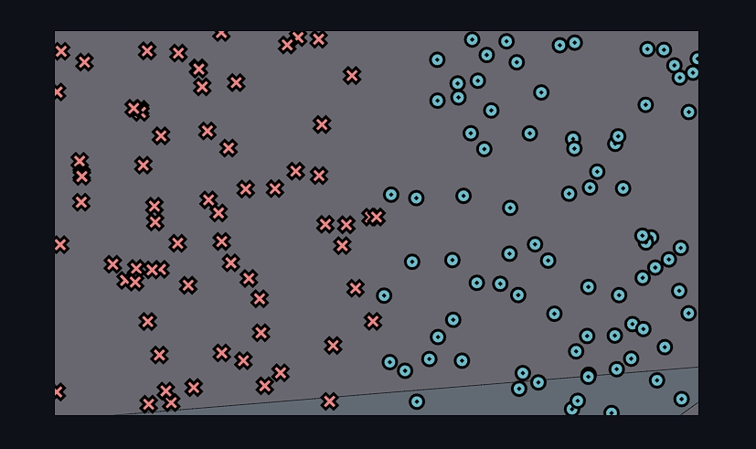
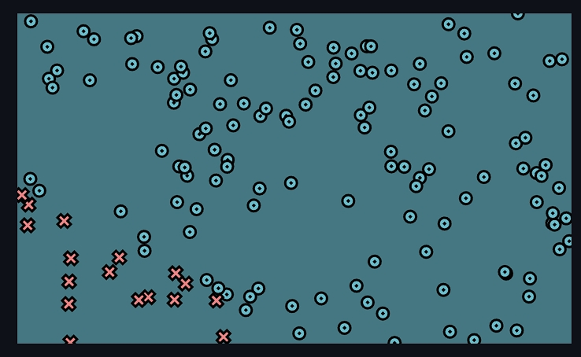
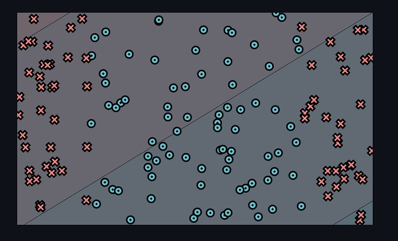
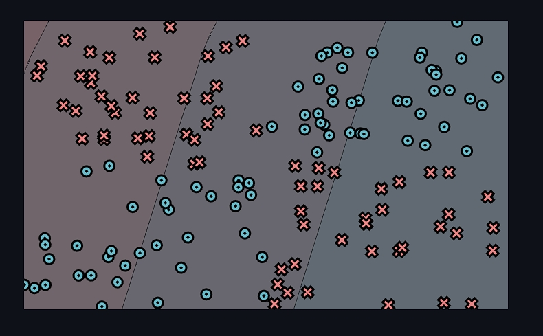
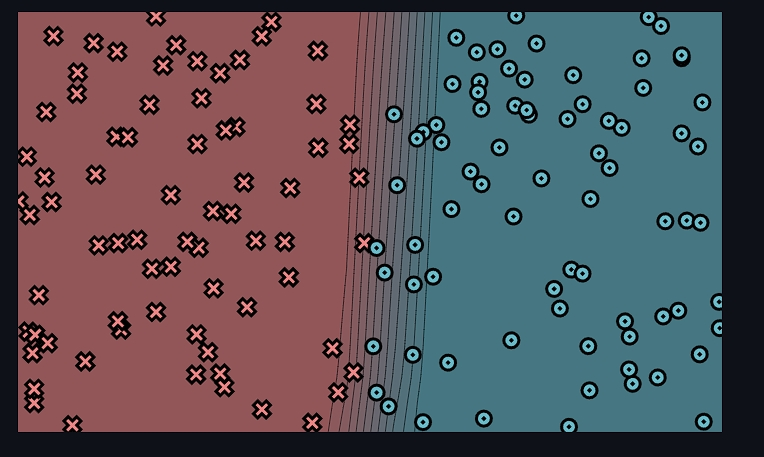
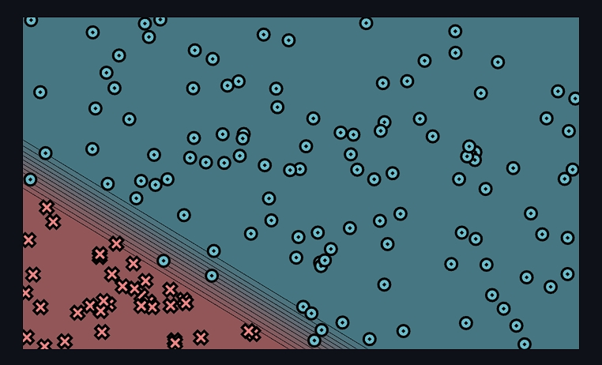
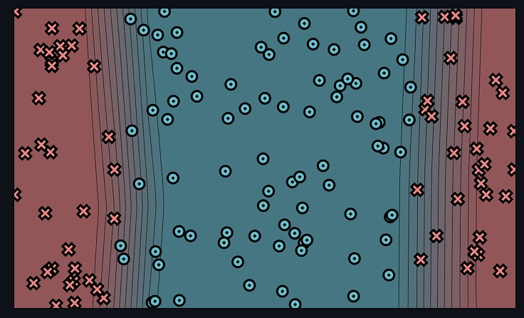
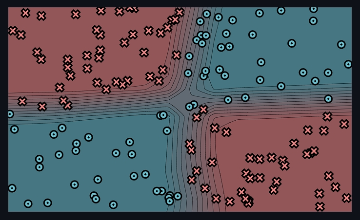

# minitorch
The full minitorch student suite. 

To access the autograder: 

* Module 0: https://classroom.github.com/a/qDYKZff9
* Module 1: https://classroom.github.com/a/6TiImUiy
* Module 2: https://classroom.github.com/a/0ZHJeTA0
* Module 3: https://classroom.github.com/a/U5CMJec1
* Module 4: https://classroom.github.com/a/04QA6HZK
* Quizzes: https://classroom.github.com/a/bGcGc12k

Markdown
## Task 0.5: Visualization

Parameters:
- `linear.weight_0_0`: -1.53
- `linear.weight_1_0`: -0.05
- `linear.bias_0`: 0.11

## Module 1: Autodiff and Scalar Training

### Datasets Training:
- **Simple**: Epochs: 500, Hidden: 2, Learning Rate: 0.5

- **Diag**: Epochs: 500, Hidden: 2, Learning Rate: 0.5

- **Split**: Epochs: 500, Hidden: 2, Learning Rate: 0.5

- **Xor**: Epochs: 500, Hidden: 10, Learning Rate: 0.5

## Module 2: Tensors and Tensor Autograd

### Training Results:
- **Simple**: Epochs: 500, Hidden: 10, Rate: 0.05, Time per epoch: ~0.698s.

- **Diag**: Epochs: 500, Hidden: 10, Rate: 0.05, Time per epoch: ~0.699s.

- **Split**: Epochs: 500, Hidden: 10, Rate: 0.05, Time per epoch: ~0.709s.

- **Xor**: Epochs: 500, Hidden: 10, Rate: 0.05, Time per epoch: ~0.712s.
